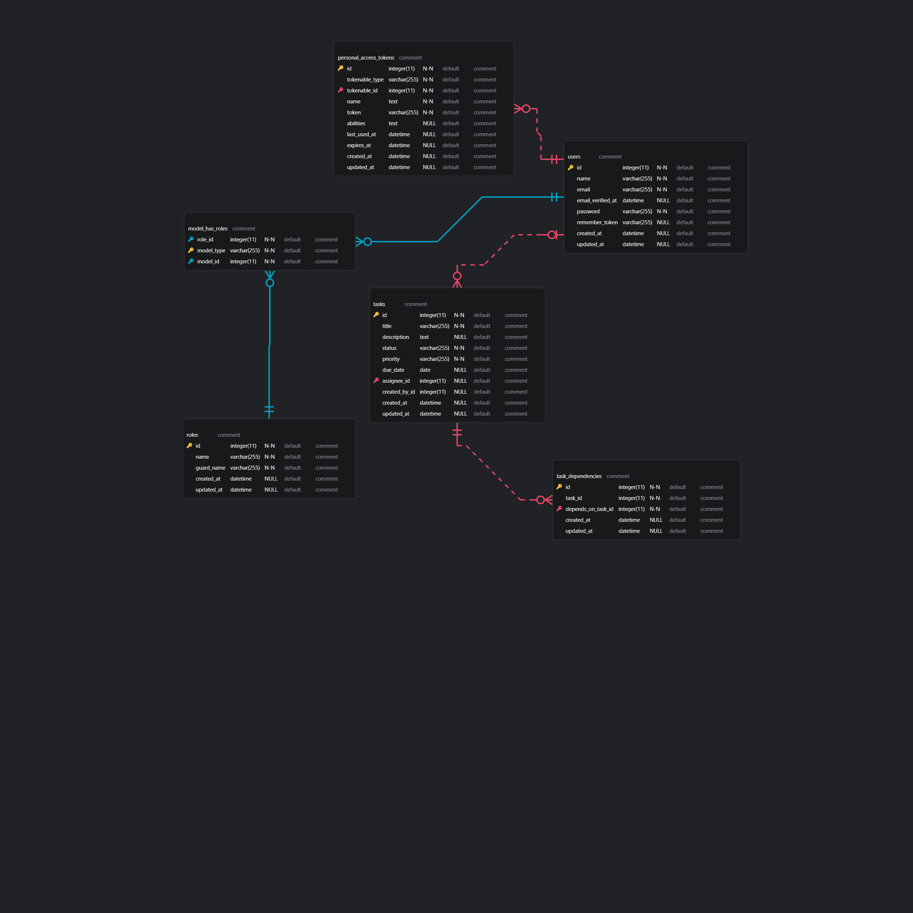

# SoftXpert Task Management API

A comprehensive RESTful API for task management with role-based access control, dependency management, and comprehensive validation.

> **Developed for SoftXpert** - Enterprise-grade task management solution

## 🚀 Features

### Core Functionality
- ✅ **Task Management** - Create, read, update tasks with full CRUD operations
- ✅ **Task Dependencies** - Manage task dependencies with circular dependency prevention
- ✅ **Status Workflow** - Task status management with dependency validation
- ✅ **Role-based Access** - Admin and User roles with different permissions
- ✅ **Authentication** - Stateless JWT authentication using Laravel Sanctum
- ✅ **Filtering & Sorting** - Advanced filtering by status, date range, assignee, priority
- ✅ **Validation** - Comprehensive validation with custom rules

### Business Rules
- 📋 **Task Creation** - Managers can create and assign tasks to users
- 👥 **Task Assignment** - Managers can assign/reassign tasks to any user
- 🔒 **User Access** - Users can only view and update status of assigned tasks
- 🔗 **Dependencies** - Tasks cannot be completed until all dependencies are done
- ⚡ **Status Control** - Flexible updates for task details, strict rules for status changes

## 📚 API Documentation

### Base URLs
- **Admin APIs**: `https://task-api.test/admin` (Managers only)
- **User APIs**: `https://task-api.test/api/v1` (Users only)

### Authentication
```http
POST /admin/login
POST /api/v1/login
Content-Type: application/x-www-form-urlencoded

email=manager@example.com&password=password
```

### Admin Endpoints (Managers)

#### Task Management
```http
GET    /admin/tasks                              # List all tasks with filters
POST   /admin/tasks                              # Create new task
GET    /admin/tasks/{task}                       # Get task details
PUT    /admin/tasks/{task}                       # Update task details
```

#### Status Management
```http
PUT    /admin/tasks/{task}/status                # Update task status
```

#### Dependency Management
```http
GET    /admin/tasks/{task}/dependencies          # Get task dependencies
POST   /admin/tasks/{task}/dependencies          # Add dependencies
DELETE /admin/tasks/{task}/dependencies/{dep}    # Remove dependency
```

### User Endpoints (Assigned Users)
```http
GET    /api/v1/tasks                             # List assigned tasks only
GET    /api/v1/tasks/{task}                      # Get assigned task details
PUT    /api/v1/tasks/{task}/status               # Update assigned task status
```

### Filtering & Sorting
```http
GET /admin/tasks?filter[status]=pending&filter[assignee_id]=1&sort=due_date&per_page=10
```

**Available Filters:**
- `status` - pending, in_progress, completed, cancelled, on_hold
- `assignee_id` - Filter by assigned user ID
- `date_range` - Due date range (YYYY-MM-DD,YYYY-MM-DD)
- `priority` - low, medium, high

## 🗃️ Database Schema



The ERD shows the complete database structure with relationships between users, tasks, dependencies, and authentication/authorization tables.

## 🔧 Installation & Setup

### Prerequisites
- PHP 8.2+
- MySQL 8.0+
- Composer
- Laravel 12.x

### Quick Start
```bash
# Clone and setup
git clone <repository-url>
cd task-api
composer install

# Environment
cp .env.example .env
php artisan key:generate

# Database
php artisan migrate
php artisan db:seed

# Start server
php artisan serve
```

### Default Users
```
Manager: manager@example.com / password (admin role)
User 1:  user@example.com / password (user role)
User 2:  user2@example.com / password (user role)
```

## 🧪 Testing

### Postman Collection
Import: `softxpert-task-api.postman_collection.json`

**Features:**
- ✅ Admin & User authentication
- ✅ All endpoints with examples
- ✅ Automatic token management
- ✅ Form-data requests with descriptions
- ✅ Error scenario testing

### Manual Testing
1. Login as manager → Test admin endpoints
2. Login as user → Test user endpoints
3. Test dependency validation
4. Test role-based access control

## 🏛️ Architecture

### Security Layers
1. **Route Middleware** - Role-based access (`role:admin`, `role:user`)
2. **Request Authorization** - Form request validation
3. **Controller Authorization** - Policy-based checks
4. **Database Scopes** - Data filtering by ownership

### Code Organization
- **Controllers** - Separate admin and user controllers
- **Requests** - Validation and authorization per endpoint
- **Resources** - Response transformation
- **Policies** - Authorization logic
- **Rules** - Custom validation rules
- **Traits** - Reusable functionality

## 📋 Business Requirements Compliance

### ✅ Main Endpoints
- ✅ Authentication for system actors
- ✅ Create new task
- ✅ Retrieve tasks with filtering (status, due date, assigned user)
- ✅ Add task dependencies with completion validation
- ✅ Retrieve task details including dependencies
- ✅ Update task details (title, description, assignee, due date)
- ✅ Update task status with dependency validation

### ✅ Role-based Authorization
- ✅ Managers can create/update tasks
- ✅ Managers can assign tasks to users
- ✅ Users can retrieve only assigned tasks
- ✅ Users can update only status of assigned tasks

### ✅ Technical Requirements
- ✅ RESTful API design
- ✅ Data validation
- ✅ Stateless authentication
- ✅ Error handling
- ✅ Database migrations/seeders

## 🛡️ Security Features

- **Authentication** - Laravel Sanctum tokens
- **Authorization** - Role-based with policies
- **Validation** - Multi-layer validation
- **Ownership** - Users access only assigned tasks
- **Dependencies** - Prevent circular and self-dependencies
- **Status Control** - Dependency completion enforcement

---

**Built with Laravel 12.x | API Version 1.0**
